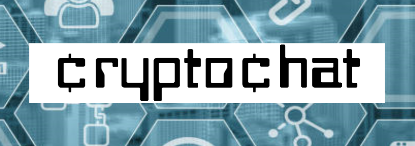

# CryptoChat

&#162;rypto&#162;hat is a centralized location for all things decentralized - cryptocurrency market values, Twitter sentiments, and a forum to chat with other traders.

## Description 

* [Github Repository](https://github.com/kirsralk/Group1-Project3).
* [Deployed on Heroku](https://secure-depths-62084.herokuapp.com/).

&#162;rypto&#162;hat is a React based app that allows users to log in securely via Auth0, and includes up-to-date currency values via API calls, a Twitter feed where users can keep current on posts from @crypto, and a classic forum backed by our MongoDB database.

* App Screenshot:


### User Story

```
AS A cryptocurrency trader. . .
I WANT to be able to chat, view currency prices and Twitter sentiments all in one place. . .
SO THAT I can take my portfolio to the moon! 🚀
```

## Installation

This app is deployed on Heroku and can be accessed from your browser at https://secure-depths-62084.herokuapp.com/.

## Credits

Created by [Cody](https://github.com/CodyYuill) & [Kirsi](https://github.com/kirsralk/). 


## License

[](https://opensource.org/licenses/MIT)